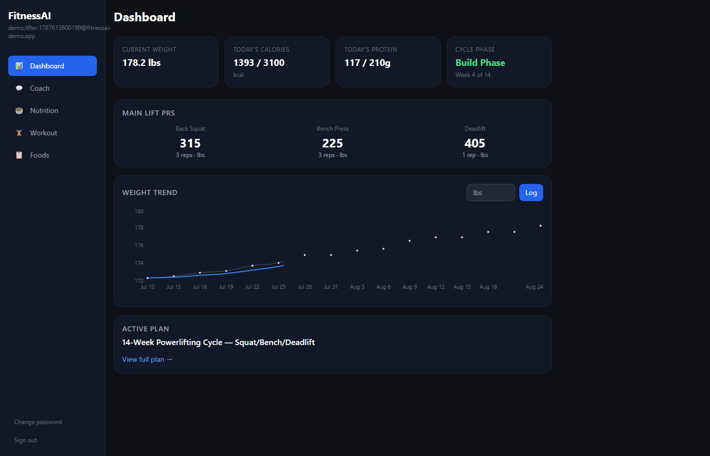
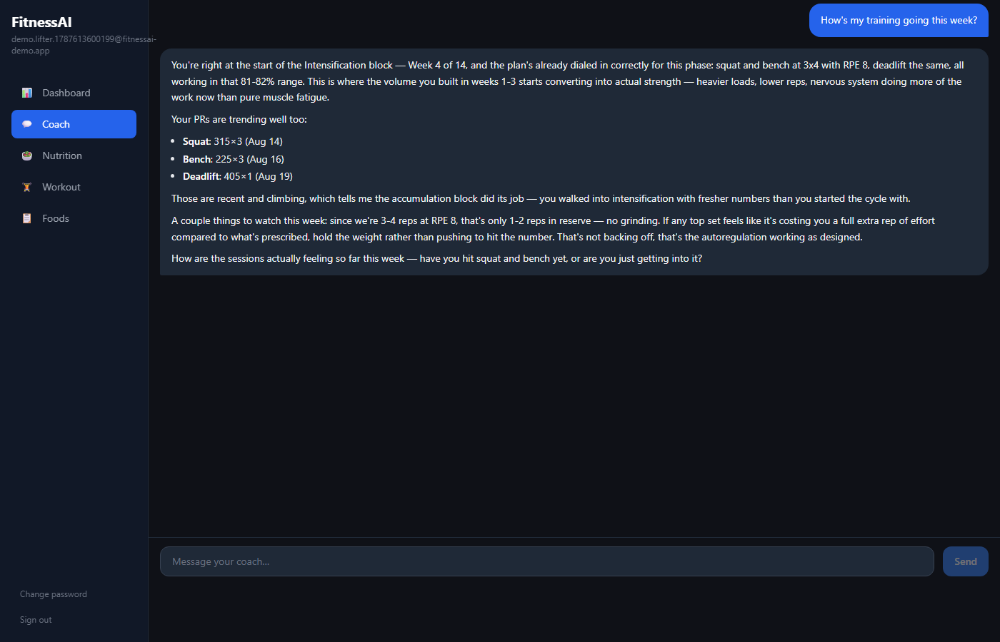
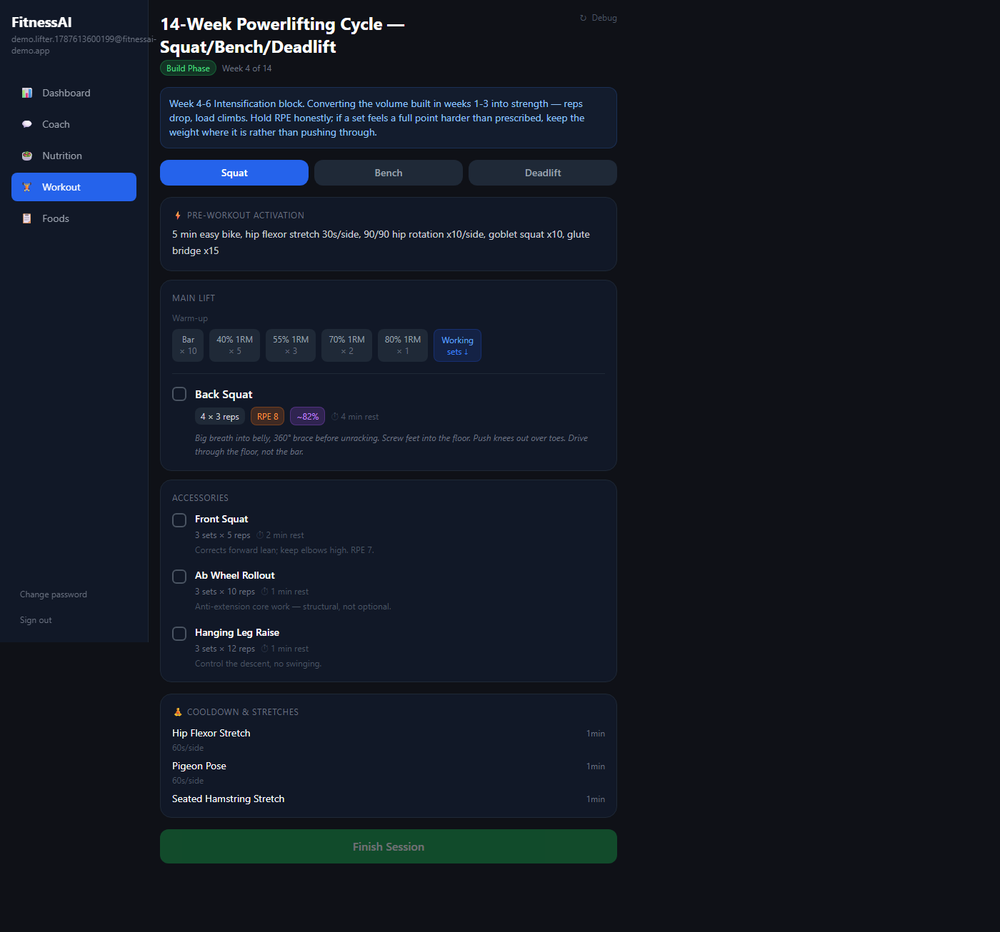
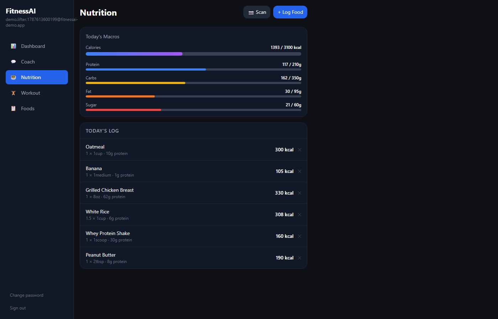

# FitnessAI

A full-stack AI personal trainer: an agentic coach that builds and adjusts powerlifting programs, tracks nutrition from a text description or a photo of a label, and keeps itself in sync with where you actually are in a 14-week training cycle — no manual bookkeeping required.

Built as a personal project to go deep on production AI-agent engineering: tool-use design, prompt reliability, and the cost/latency tradeoffs that only show up once real usage hits a real system.

---

## Screenshots

| | |
|---|---|
|  |  |
| **Dashboard** — weight trend, PRs, macros, cycle phase | **AI Coach** — agentic chat, grounded in real logged data |
|  |  |
| **Workout Plan** — full block-periodized program | **Nutrition Log** — daily macros against targets |

---

## Features

| | |
|---|---|
| **AI Coach** | Conversational agent (Claude) that calls real tools — PRs, nutrition summary, workout plan, weight history — before answering, so it never invents a number |
| **Auto-Generated Training Plans** | Builds a full 3-day powerlifting split (squat/bench/deadlift) with warm-up pyramids, RPE/rest targets, and accessory selection reasoned from each lift's weak points |
| **Block Periodization Tracking** | Tracks a 14-week cycle (Accumulation → Intensification → Deload → 2nd Accumulation → Peaking → Rest). The coach checks the current block on every message and proactively rebuilds the plan itself if it's gone stale for the new block — you don't have to notice or ask |
| **Nutrition Logging** | Log food by chat ("log a banana"), by search, or by photo — snap a nutrition label or a plate and Claude's vision extracts calories/macros directly |
| **Food Library** | Foods you've logged before are saved and deduped, so re-logging the same meal doesn't create duplicate entries |
| **Progress Tracking** | Weight trend chart with rolling average, per-exercise PR history |
| **Push Notifications** | Installable PWA with a service worker; a daily cron job nudges users who haven't logged weight in 3+ days |

---

## Skills Demonstrated & Tools Used

This project was built as a hands-on exercise in shipping an LLM-backed product past the demo stage — the parts that only show up once an agent is handling real tool calls, real users, and a real bill.

**Agentic AI system design**
- Multi-turn tool-use loop: the coach decides which of 12 tools to call (querying PRs, nutrition, workout state; writing logs, plans, targets) and chains them before responding, rather than a single scripted prompt-response.
- Structured generation: workout plans are returned as schema-constrained JSON (nested per-day objects with warm-up sets, RPE, rest windows) that gets saved and rendered directly — not free text a human has to parse.
- Vision as a tool: a separate Claude Haiku call handles nutrition-label/food-photo parsing, kept isolated from the conversational agent to keep it fast and cheap.

**Prompt engineering & AI reliability under real usage**
- Diagnosed a live production bug where hidden "thinking" tokens were silently consuming 1,000+ of a 4,096 output-token budget before the model could finish a large tool call — causing truncated and blank coach replies. Root-caused it by reproducing the exact failure against the real API and production database rather than guessing, then fixed it by disabling extended thinking for this workload and raising the token ceiling.
- Designed a self-correcting instruction: the current training-cycle week/phase is computed server-side and injected into the system prompt for free (no extra tool call), paired with an explicit rule telling the coach to detect a stale plan and rebuild it unprompted — verified end-to-end against the live API before shipping.

**Cost-conscious LLM engineering**
- Prompt caching on the system prompt and tool schemas (~90% cost reduction on repeat calls).
- Disabling unused reasoning tokens once shown to add cost without improving output quality.
- API-call shape kept flat as data grows: nutrition/food queries are always scoped to "today" or a small result limit, never the full history, so the token cost per message doesn't creep up as a user's log grows.

**Full-stack & backend engineering**
- REST API in Express with JWT auth (bcrypt-hashed passwords, scoped middleware).
- PostgreSQL schema design (Neon, serverless) with foreign keys, unique constraints for dedup, and indexes matched to actual query patterns.
- React 19 frontend (Vite, Tailwind, Recharts) with a PWA manifest, service worker, and Web Push integration.

**Production debugging methodology**
- Practiced root-causing a live bug end-to-end: read the diff that shipped it, queried the real database directly to see actual state, replayed the exact system prompt/tools/conversation history against the real Anthropic API outside the app to isolate the failure, then verified the fix the same way before deploying — rather than pushing a speculative patch and hoping.

**Tools used:** Built primarily through iterative pair-programming with [Claude Code](https://claude.com/claude-code), Anthropic's agentic CLI, including live production-debugging sessions — reading logs and diffs, querying the production database directly, and reproducing failures against the real API to confirm root cause before shipping a fix. Deployed on [Render](https://render.com) with [Neon](https://neon.tech) Postgres.

---

## Tech Stack

**Backend**
- Node.js + Express
- PostgreSQL (Neon, serverless) via `pg`
- JWT authentication, bcrypt password hashing
- [Anthropic SDK](https://www.npmjs.com/package/@anthropic-ai/sdk) — agentic tool use, prompt caching, vision
- `web-push` for Web Push notifications
- `multer` for in-memory image upload (food/label photo scanning)

**Frontend**
- React 19 + Vite
- Tailwind CSS
- Recharts (weight trend)
- React Router
- PWA: manifest + service worker, installable to home screen

**AI**
- Claude Sonnet — the conversational coach: agentic tool use (PRs, nutrition, workout plan, weight, notifications), structured workout-plan generation
- Claude Haiku — vision-based nutrition extraction from food/label photos

**Deployment**
- Render (backend + frontend as separate services, `render.yaml` infra-as-config)
- Neon Postgres
- cron-job.org for the daily weight-reminder and keepalive pings

---

## Getting Started

### Prerequisites

- [Node.js v18+](https://nodejs.org)
- A [Neon](https://neon.tech) (or any) PostgreSQL database
- An [Anthropic API key](https://console.anthropic.com)

### Installation

```bash
git clone https://github.com/Krusol21/FitnessAI.git
cd FitnessAI
```

**Backend:**
```bash
cd backend
npm install
cp .env.example .env
```

Open `.env` and fill in:
```
ANTHROPIC_API_KEY=your_anthropic_api_key
JWT_SECRET=your_jwt_secret
DATABASE_URL=your_postgres_connection_string
```

Generate a JWT secret:
```bash
node -e "console.log(require('crypto').randomBytes(64).toString('hex'))"
```

**Frontend:**
```bash
cd ../frontend
npm install
```

### Running

```bash
# terminal 1
cd backend && npm run dev

# terminal 2
cd frontend && npm run dev
```

App runs at `http://localhost:5173`; the backend listens on `3002` and the frontend dev server proxies `/api` to it.

---

## Project Structure

```
FitnessAI/
├── backend/
│   ├── agent/
│   │   └── tools.js         # Claude tool definitions + tool execution
│   ├── routes/
│   │   ├── agent.js         # Chat endpoint — agentic tool-use loop, prompt caching
│   │   ├── scan.js          # Photo → nutrition extraction (Claude vision)
│   │   ├── nutrition.js     # Food library, logs, macro targets
│   │   ├── workouts.js      # Workout plans, cycle-week/phase tracking
│   │   ├── progress.js      # Weight history, PRs
│   │   ├── notifications.js # Web Push + daily cron reminder
│   │   └── auth.js
│   ├── database.js          # Postgres schema, migrations
│   └── server.js
├── frontend/
│   └── src/
│       ├── components/       # Dashboard, ChatInterface, WorkoutPlan, NutritionLog, FoodLibrary
│       └── hooks/            # usePushNotifications
└── render.yaml
```

## How It Works

Every chat message runs through an agentic loop: Claude decides which tools to call — current PRs, today's nutrition, the active workout plan, weight history — executes them against the real database, and only then composes a reply. Nothing the coach says about your numbers is invented; if it doesn't have real data, it calls a tool to get it first.

The system prompt is split into a large cached block (coaching rules, periodization schedule, tool-use policy) and a small uncached block rebuilt every message with the current date, today's logged macros, and the current cycle week/phase — computed server-side with plain date math, at zero extra API cost. That live block-phase signal is what lets the coach catch a stale training block and rebuild the plan on its own, without the user having to notice or ask.
